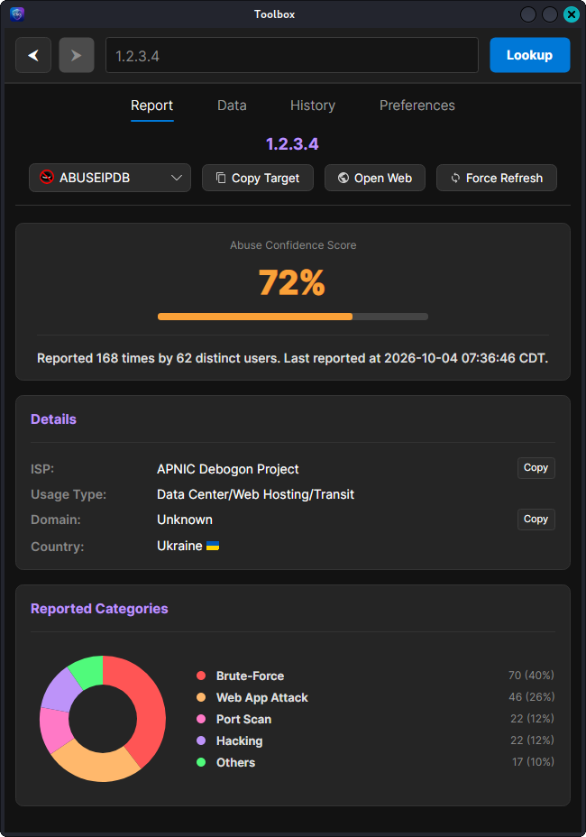
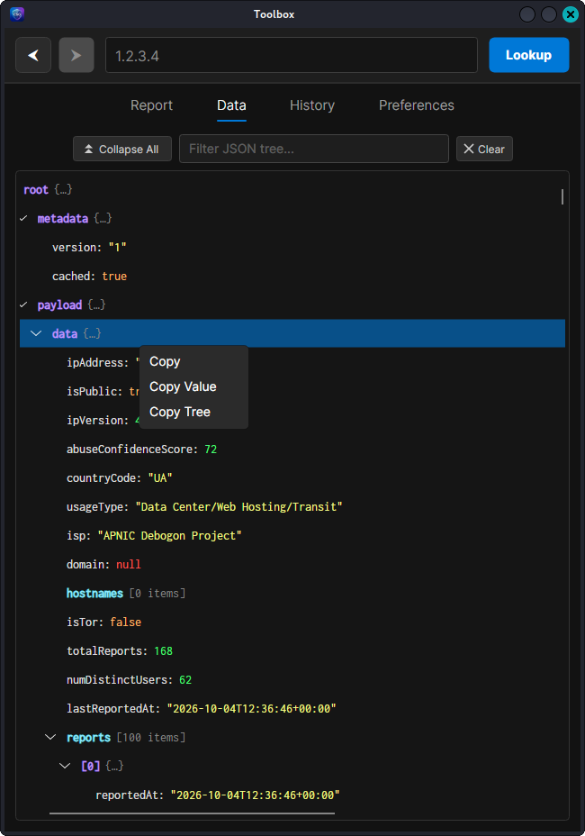
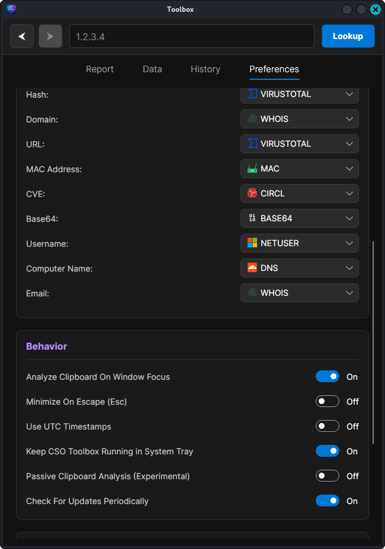
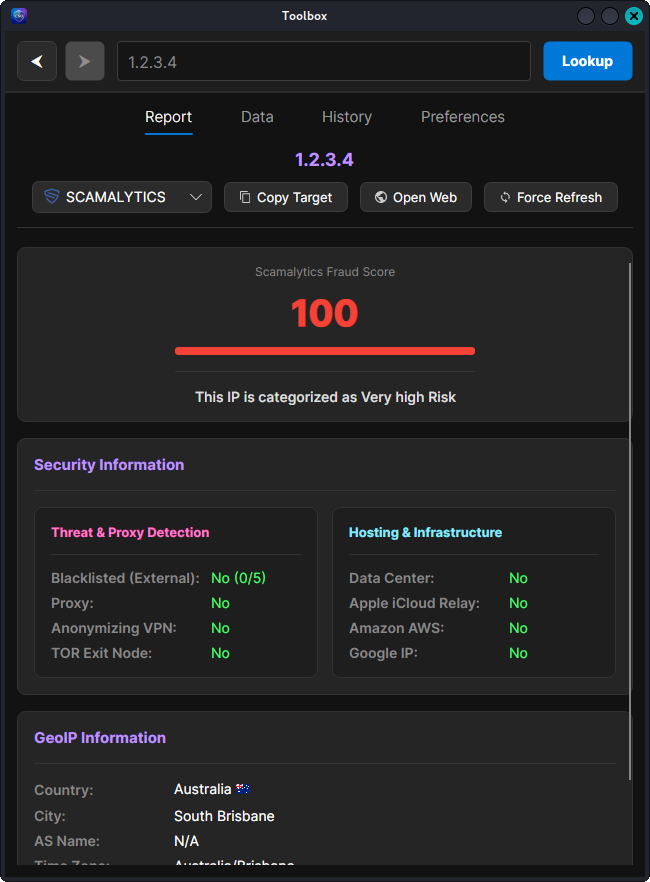
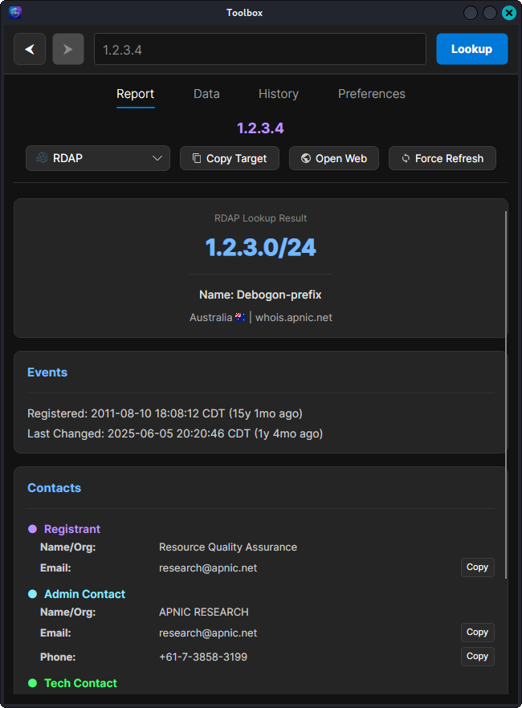
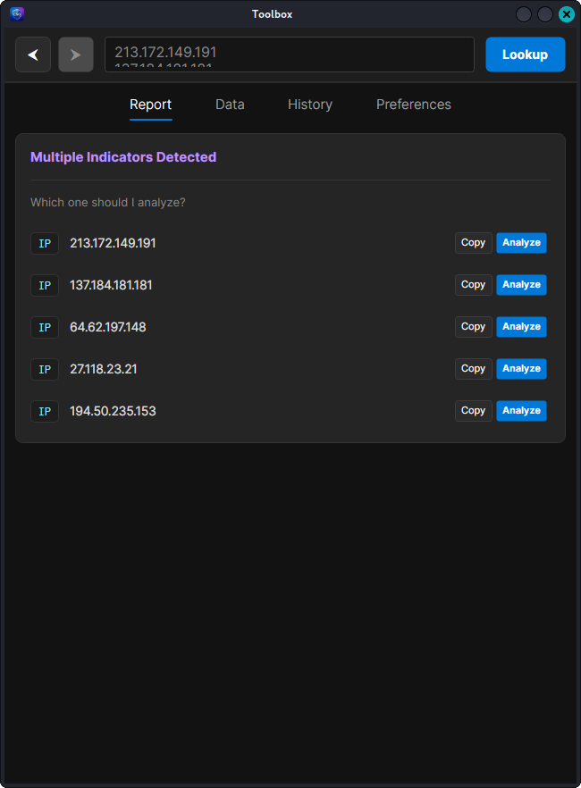

# CSO Toolbox

CSO Toolbox is a desktop helper for security operations work. It recognizes indicators in text or clipboard content and displays reports from a separately hosted Python service. The client supports Windows and Linux; the server provides a local HTTP API over HTTPS.

The project is under active development. Treat it as beta software and review its behavior before using it with important systems or sensitive indicators.

## Features

- Extracts IP addresses, domains, URLs, email addresses, hashes, CVEs, MAC addresses, and other indicators from text.
- Queries services including AbuseIPDB, VirusTotal, MalwareBazaar, ThreatFox, CIRCL, Shodan, RDAP, DNS, WHOIS, and Scamalytics.
- Keeps analysis history locally and can monitor clipboard content.
- Includes server-side OCR and optional local IP network annotations.
- Lets operators self-host the backend and provide their own upstream service credentials.

## Screenshots

| AbuseIPDB report | Raw data view | Preferences |
| --- | --- | --- |
|  |  |  |

| Scamalytics report | RDAP report | Multiple indicators |
| --- | --- | --- |
|  |  |  |

## How it works

The desktop client sends an indicator to the configured CSO Toolbox server. The server calls the selected upstream service and returns a normalized response. Review the [architecture notes](docs/ARCHITECTURE.md) and [configuration guide](docs/CONFIGURATION.md) before connecting the application to real data.

## Requirements

- .NET 10 SDK to build the desktop client.
- [uv](https://docs.astral.sh/uv/getting-started/installation/) to manage the server environment and dependencies. uv can install Python 3.12 when needed.
- A supported OS for Avalonia desktop applications.
- API credentials for any upstream services you want to use. Service credentials belong in the server configuration, never in the desktop client.

## Run the server

```sh
cd Server
uv venv --python 3.12
uv pip install -r requirements.txt
cp data/config.example.yaml data/config.yaml
```

From the `Server` directory, activate the environment with `source .venv/bin/activate` on macOS/Linux, `.\.venv\Scripts\Activate.ps1` from PowerShell, or `.venv\Scripts\activate.bat` from Command Prompt.

### Generate and pin the server certificate

Run the generator from the `Server` directory:

```sh
python gen_cert.py
```

It creates `Server/data/cert.pem` and `Server/data/key.pem`, which the server uses for HTTPS, prints the certificate's SHA-256 fingerprint, and writes the fingerprint to `Client/Lib/GeneratedCertificatePin.cs`. Build the client after generating the certificate so the pin is included. With pinning enabled, the client accepts the server certificate only when its fingerprint matches this pin. If you replace or regenerate the certificate, run the generator again and rebuild the client.

The generated certificate is self-signed for `localhost` and is intended for local development. For a remote deployment, use a certificate issued for the server's hostname and configure the client with that certificate's SHA-256 fingerprint. Keep the private key secret and out of version control.

Edit `data/config.yaml` to add the upstream credentials you have. Keep this file out of version control.


Start the server from the `Server` directory:

```sh
python main.py
```

It listens on port 5059. The client starts with `https://localhost:5059`; change the backend address in the client's Preferences for a remote deployment.

## Build and run the client

```sh
dotnet restore Client/Client.csproj
dotnet run --project Client/Client.csproj --framework net10.0
```

Build a release for the current platform with:

```sh
dotnet publish Client/Client.csproj -c Release --framework net10.0
```

## Development checks

Run the server test suite from the repository root after activating the `Server/.venv` environment:

```sh
cd Server
uv pip install -r requirements-dev.txt
python -m pytest
```

Run the client’s built-in checks:

```sh
dotnet run --project Client/Client.csproj --framework net10.0 -- --run-tests
```

## Configuration

See [Server/data/config.example.yaml](Server/data/config.example.yaml) for the server configuration shape and [docs/CONFIGURATION.md](docs/CONFIGURATION.md) for backend, DNS, certificates, and local network annotations.

## License

CSO Toolbox source code is licensed under the GNU General Public License, version 3 or later. See [LICENSE](LICENSE) and [third-party notices](THIRD_PARTY_NOTICES.md) for bundled asset terms.
